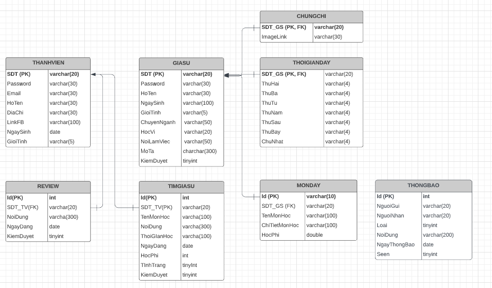

# Quản Lý Cửa Hàng Gà Rán

### Nhóm 12
|STT  |MSSV        |Họ và tên       |
|:---:|:----------:|----------------|
|1    |18520866 | Hồ Công Huynh |
|2    |18520371  | Bùi Anh Thư |
***

### 1. Giới thiệu ứng dụng
- Quản lý cửa hàng gà rán là ứng dụng giúp cửa hàng kinh doanh gà rán nói riêng và các cửa hàng kinh doanh thức ăn nhanh nói chung giúp cửa hàng kiểm soát đơn hàng, doanh thu, quản lý sản phẩm, quy trình bán hàng, chăm sóc khách hàng,....
- Ứng dụng bao gồm một số chức năng chính như: 
  * Chức năng đăng nhập
  * Chức năng đổi mật khẩu
  * Chức năng quản lý khách hàng
  * Chức năng quản lý nhập hàng
  * Chức năng quản lý nhà cung cấp
  * Chức năng xuất hoá đơn
  * Chức năng bán hàng
  * Chức năng xuất phiếu nhập
  * Chức năng quản lý khuyến mãi

### 2. Công cụ sử dụng
- IDE code Java: NetBeans và IntelliJ
- Database: phpMyAdmin
- Quản lý source: Github
- Hệ điều hành: Windows 10 và MacOS

### 3. Mô hình Entity Relationship Diagram

### 4. Structure
`database` : Sử dụng để connect database  
`model` : Tương tác với database (GET, PUT, POST...)   
`resources`: Sử dụng để lưu hình ảnh âm thanh  
`view`: Dùng để lưu file code màn hình/ giao diện.   
`tester`: Lưu các file test.  
`sql`: Chứa file phpAdminDatabase.sql bao gồm tất cả dữ liệu của ứng dụng.  
***Note: Có thể xóa file `.gitkeep`:  File này ko có tác dụng gì***

### 5. Hướng dẫn:
1) Tạo database "quanlygaran" và import ./sql/phpAdminDatabase.sql vào MySQL.
2) Import các thư viện liên quan trong thư mục /libs/
