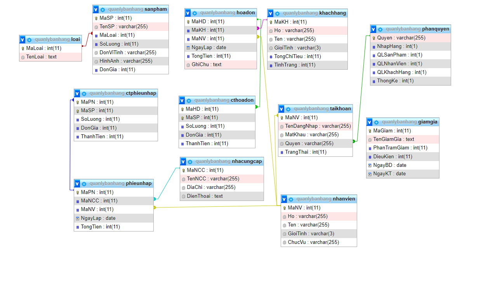

# Quản Lý Trung Tâm Gia Sư - Java_IS216.M21_12

### Giới thiệu ứng dụng
TODO: ***********
### Mô hình Entity Relationship Diagram

### Structure
`database` : Sử dụng để connect database  
`model` : Tương tác với database (GET, PUT, POST...)   
`resources`: Sử dụng để lưu hình ảnh âm thanh  
`view`: Dùng để lưu file code màn hình/ giao diện.   
`tester`: Lưu các file test.  
`sql`: ??????? 

**Note: Có thể xóa file `.gitkeep`:  File này ko có tác dụng gì**